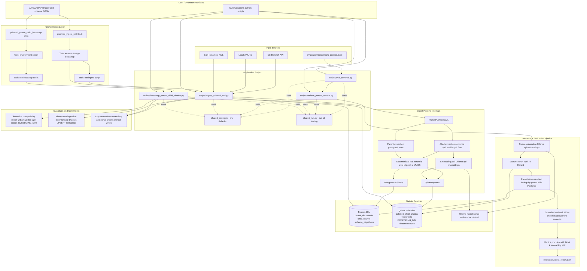

# PubMed RAG Pipeline Architecture

## 1. Purpose
This document describes the end-to-end local architecture for a high-precision Clinical Decision Support (CDS) PubMed Retrieval-Augmented Generation (RAG) environment built with hierarchical parent-child chunking.

- Parent chunks: full clinical paragraphs (stored in PostgreSQL)
- Child chunks: sentence-level units (embedded and indexed in Qdrant)

## 2. System Components

- App container: Python development/runtime environment for scripts and services
- PostgreSQL: source-of-truth store for parent documents and parent-child mappings
- Qdrant: vector index for child chunks
- Ollama: local embedding/LLM inference endpoint
- Airflow standalone: orchestration for bootstrap and ingestion tasks

## 3. Architecture Diagram

## 3.1 Reading the Diagram

- Interfaces: CLI and Airflow are parallel entrypoints into the same script layer.
- Control flow: Airflow DAG tasks call the same Python scripts used in direct CLI execution.
- Data flow: ingestion produces both relational lineage (Postgres) and vector index state (Qdrant).
- Retrieval flow: query embedding + vector search + parent reconstruction form the grounded context path.
- Evaluation flow: benchmark queries repeatedly call retrieval and compute aggregate quality metrics.
- Guardrails: bootstrap and ingest enforce compatibility and idempotent behavior.

## 4. Data Model

### PostgreSQL Tables

1. `schema_migrations`
- version
- applied_at

2. `parent_documents`
- parent_id (PK)
- pmid
- source
- title
- section_title
- paragraph_text
- created_at

3. `child_chunks`
- child_id (PK)
- parent_id (FK -> parent_documents.parent_id)
- child_index
- qdrant_point_id (unique)
- child_text
- created_at

### Qdrant Collection

- Collection name: `pubmed_child_chunks` (configurable)
- Vector size: `EMBEDDING_DIM` (default 768)
- Distance metric: cosine
- Payload fields (example): pmid, parent_id, child_index, section_title, source, child_text

## 5. Pipeline Stages

1. Bootstrap stage
- Create relational schema and indexes
- Ensure migration marker exists
- Ensure Qdrant collection exists with expected embedding dimension
- Validate service reachability (Postgres and Qdrant)

2. Ingestion stage
- Read XML input (sample/file/NCBI)
- Parse article abstracts into parent paragraphs
- Split each paragraph into sentence-level child chunks
- Insert/update parent and child metadata in PostgreSQL
- Generate embeddings for child chunks through Ollama
- Upsert vectors and metadata payloads into Qdrant
- Emit run-scoped logs via `run_id`

3. Retrieval stage (conceptual)
- Embed user query
- Search Qdrant for nearest child chunks
- Join child results to parent_documents in PostgreSQL
- Build context windows from parent paragraph text
- Send grounded context to generation layer

4. Evaluation stage
- Read benchmark query rows from `evaluation/benchmark_queries.jsonl`
- Execute retrieval per query with fixed `top-k`
- Compute precision@k, hit@k, and traceability@k
- Persist JSON report to `evaluation/latest_report.json` (or custom output path)

## 6. Runtime Execution Paths

### Direct CLI path
- Bootstrap:
  - `python scripts/bootstrap_parent_child_chunks.py`
- Ingest sample:
  - `python scripts/ingest_pubmed_xml.py --use-sample`
- Retrieve:
  - `python scripts/retrieve_parent_context.py --query "..." --top-k 5`
- Evaluate:
  - `python scripts/eval_retrieval.py --top-k 5 --output-file evaluation/latest_report.json`

### Containerized CLI path (recommended)
- `docker compose -f .devcontainer/docker-compose.yml exec -T app python scripts/bootstrap_parent_child_chunks.py`
- `docker compose -f .devcontainer/docker-compose.yml exec -T app python scripts/ingest_pubmed_xml.py --use-sample`
- `docker compose -f .devcontainer/docker-compose.yml exec -T app python scripts/retrieve_parent_context.py --query "..." --top-k 5`
- `docker compose -f .devcontainer/docker-compose.yml exec -T app python scripts/eval_retrieval.py --top-k 5 --output-file evaluation/latest_report.json`

### Airflow path
- DAG `pubmed_parent_child_bootstrap`
  - validates environment
  - runs bootstrap script
- DAG `pubmed_ingest_xml`
  - ensures storage bootstrap
  - runs ingest script

## 6.1 Configuration and Runtime Contracts

- Configuration defaults are centralized in `scripts/shared_config.py`.
- Shared runtime log correlation is provided by `scripts/shared_run.py`.
- Key environment variables:
  - `POSTGRES_DSN`
  - `QDRANT_URL`
  - `QDRANT_COLLECTION`
  - `OLLAMA_URL`
  - `EMBEDDING_MODEL`
  - `EMBEDDING_DIM`
  - `RUN_ID` (optional; can also pass `--run-id`)

## 6.2 Idempotency and Deterministic Identity

- `parent_id` is derived from PMID + paragraph index.
- `child_id` is derived from parent + child index.
- `qdrant_point_id` is a deterministic UUID5 from parent + child index.
- Combined with UPSERT operations, reruns are predictable and non-duplicative.

## 7. Precision-Oriented Design Notes

- Parent-child separation improves traceability and recall balance:
  - child vectors improve semantic match granularity
  - parent text preserves full clinical context for answer grounding
- Deterministic IDs (`parent_id`, `child_id`, `qdrant_point_id`) support idempotent upserts and repeatable ingestion.
- Explicit schema versioning supports controlled evolution.

## 8. Operational Checks

- Service health:
  - PostgreSQL on 5432
  - Qdrant on 6333/6334
  - Ollama on 11434
  - Airflow UI on 8080
- Data checks:
  - row counts in `parent_documents` and `child_chunks`
  - point count in `pubmed_child_chunks`
- Orchestration checks:
  - Airflow DAG listing and task test execution
- Quality checks:
  - run retrieval evaluation and verify precision/traceability summary trends
  - verify retrieval output includes parent reconstruction for returned child hits
- Test checks:
  - `python -m unittest discover -s tests -v`

## 9. Known Constraints

- Airflow and SQLAlchemy compatibility is pinned for stability.
- Airflow dependencies for these DAG scripts are baked into the Airflow image in `.devcontainer/docker-compose.yml`.
- Ollama model must be available locally (for example `nomic-embed-text`) before non-dry-run ingestion.
- Embedding dimension must stay aligned with Qdrant collection vector size.
