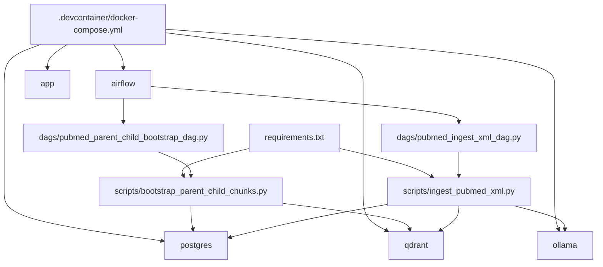

# Guide: Concepts, Files, and Dependencies

## 1. What You Are Building
You are working on a local RAG system for clinical literature where:

- PostgreSQL stores full paragraph-level source content (parents)
- Qdrant stores sentence-level vector embeddings (children)
- Ollama generates embeddings locally
- Airflow orchestrates repeatable tasks

Think of it like this:
- Qdrant finds relevant small snippets fast
- PostgreSQL gives the full trusted paragraph context for final reasoning

## 2. Core Concepts

1. Parent chunk
- A larger text block (for example one abstract paragraph)
- Stored in `parent_documents`

2. Child chunk
- A sentence-sized segment derived from a parent
- Embedded into vectors and indexed in Qdrant
- Also stored in `child_chunks` as metadata and linkage

3. Hierarchical retrieval
- Search at child level for precision
- Reconstruct at parent level for context completeness

4. Idempotent ingestion
- Running ingestion multiple times should not duplicate data unexpectedly
- Achieved using deterministic IDs and UPSERT logic

## 2.1 Detailed RAG Concepts

This section explains the project in software architecture terms first, then maps those ideas to AI terms.

### A. Why vectors are needed

Traditional keyword search uses exact token matches. Clinical writing often uses paraphrases, abbreviations, and wording variation.

- Query: "early kidney injury marker"
- Document sentence: "biomarker-guided assessment improved early risk stratification"

A lexical engine may miss this relation. Vector embeddings convert text into numeric arrays where semantic similarity can be measured.

In practice:
- Each child sentence is transformed to an embedding vector.
- Query text is transformed to a query vector.
- Qdrant returns nearest vectors using cosine distance.

### B. Why hierarchical parent-child chunking exists

Single-size chunking causes trade-offs:

- Large chunks: good context, poor retrieval precision.
- Small chunks: good precision, weak context completeness.

Hierarchical strategy solves both:

1. Parent chunk (Postgres)
- Full paragraph with richer medical context.

2. Child chunk (Qdrant)
- Sentence-level retrieval unit for precision.

3. Mapping layer (Postgres child table)
- Child points map back to parent paragraphs.

Result:
- Search small units, answer with larger grounded context.

### C. Why Postgres and Qdrant are both necessary

Qdrant is optimized for vector nearest-neighbor operations, not as a canonical relational store.
Postgres provides:

- Referential integrity
- deterministic IDs and upserts
- richer metadata joins and auditability

Qdrant provides:

- fast vector similarity search
- payload filtering by metadata

System pattern:
- Postgres = source of truth for document lineage and structure.
- Qdrant = retrieval acceleration layer.

### D. Embeddings, model coupling, and schema constraints

Embedding vectors have fixed size (dimension), for example 768.

Important rule:
- Qdrant collection vector dimension must match embedding model output dimension.

If model dimension changes without collection migration, writes fail or produce invalid retrieval behavior.

This is why bootstrap checks and enforces collection compatibility.

### E. Precision, recall, and clinical safety implications

For CDS workflows:

- Precision: returned context should be clinically relevant.
- Recall: relevant evidence should not be missed.

Child-level retrieval boosts precision.
Parent reconstruction preserves sufficient context to support safe interpretation.

Without parent reconstruction, models may overfit to isolated sentences.
Without child retrieval, broad paragraphs may dilute ranking quality.

### F. Why deterministic IDs and upserts matter

In ingestion pipelines, idempotency is a reliability requirement.

This project uses deterministic identifiers:

- `parent_id` based on PMID + paragraph index
- `child_id` based on parent + sentence index
- `qdrant_point_id` based on deterministic UUID strategy

So rerunning ingestion:
- updates existing entities predictably
- avoids duplicate rows/points
- supports incremental reprocessing

### G. What Airflow adds beyond running scripts manually

Airflow gives:

- schedulable, repeatable execution
- task-level observability and retries
- composable DAG steps (bootstrap before ingest)

Software analogy:
- manual script run = ad hoc shell command
- Airflow DAG = versioned CI-like workflow for data operations

### H. Typical request-time flow (conceptual)

1. User question arrives.
2. Question is embedded using same embedding model family.
3. Top-k child chunks retrieved from Qdrant.
4. Child hits are mapped to parent paragraphs via Postgres.
5. Parent text is assembled as grounded evidence context.
6. Answer generation uses only this evidence context.

This flow is the core mechanism that reduces hallucination versus plain LLM prompting.

### I. Failure modes you should expect

1. Embedding model unavailable
- Symptom: Ollama embedding call fails.

2. Embedding dimension mismatch
- Symptom: Qdrant upsert or retrieval inconsistency.

3. Mapping drift
- Symptom: relevant child hits cannot reconstruct useful parent context.

4. Partial writes
- Symptom: Postgres rows exist but Qdrant points missing (or inverse).

Operationally, always validate both relational counts and vector counts.

## 3. File-by-File Breakdown

### Environment and Infrastructure

- [.devcontainer/devcontainer.json](../.devcontainer/devcontainer.json)
  - VS Code devcontainer settings
  - extension preinstalls
  - port forwarding
  - Python setup and post-create dependency install

- [.devcontainer/docker-compose.yml](../.devcontainer/docker-compose.yml)
  - defines multi-container topology
  - app, qdrant, postgres, ollama, airflow
  - healthchecks, volumes, and shared `rag-network`

- [requirements.txt](../requirements.txt)
  - pinned Python dependencies used by app scripts

### Data and Orchestration Logic

- [scripts/bootstrap_parent_child_chunks.py](../scripts/bootstrap_parent_child_chunks.py)
  - initializes Postgres schema and indexes
  - writes schema migration marker
  - creates/validates Qdrant collection dimensionality

- [scripts/ingest_pubmed_xml.py](../scripts/ingest_pubmed_xml.py)
  - reads XML payload
  - extracts parent paragraphs
  - splits into child sentences
  - writes parent/child rows to Postgres
  - calls Ollama embeddings
  - upserts vectors to Qdrant

- [dags/pubmed_parent_child_bootstrap_dag.py](../dags/pubmed_parent_child_bootstrap_dag.py)
  - Airflow task wrapper for bootstrap flow

- [dags/pubmed_ingest_xml_dag.py](../dags/pubmed_ingest_xml_dag.py)
  - Airflow task wrapper for ingest flow

## 4. Dependency Graph (Practical)

## 5. How Data Moves During Ingest

1. XML is read from sample/file/NCBI.
2. Each abstract section becomes a parent paragraph.
3. Paragraph is split into sentence children.
4. Parent and child metadata are upserted into PostgreSQL.
5. Each child sentence is embedded by Ollama.
6. Embeddings and payloads are upserted into Qdrant.

Outcome:
- relational traceability in Postgres
- semantic searchability in Qdrant

## 6. What to Check When Something Breaks

1. Container health
- `docker compose ps`
- all services should be up and healthy

2. Dependency mismatches
- run package install in app container
- verify Airflow task command installs needed libs if not baked into image

3. Embedding failures
- ensure Ollama is reachable
- ensure embedding model is pulled (`nomic-embed-text`)
- confirm embedding dimension matches bootstrap config

4. Data mismatch symptoms
- rows exist in Postgres but no Qdrant points:
  - likely embedding/upsert issue
- Qdrant points exist but poor reconstruction:
  - likely parent-child mapping issue

## 7. Safe First Tasks

1. Run dry-run ingest and verify parsed counts.
2. Run full ingest with sample XML and validate row/point counts.
3. Add one unit-like script for deterministic sentence splitting tests.
4. Add simple retrieval script:
- embed query
- search top-k child chunks
- join to parent text

## 8. Recommended Learning Order

1. Read [docs/01_pipeline_architecture.md](01_pipeline_architecture.md)
2. Read [scripts/bootstrap_parent_child_chunks.py](../scripts/bootstrap_parent_child_chunks.py)
3. Read [scripts/ingest_pubmed_xml.py](../scripts/ingest_pubmed_xml.py)
4. Read [dags/pubmed_ingest_xml_dag.py](../dags/pubmed_ingest_xml_dag.py)
5. Execute and observe one full ingest cycle

## 9. Glossary

- RAG: retrieval-augmented generation
- Parent chunk: larger grounded context block
- Child chunk: smaller vectorized retrieval unit
- Upsert: insert or update existing row/point
- Embedding dimension: vector length expected by index schema
